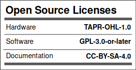

### Ownership and License
The contributors are listed in CONTRIB.TXT.

Licenses | OSHWA UID
--|--
 | 

### Overview

The [EEZ DIB](https://github.com/eez-open/modular-psu) 4-channel Hi-voltage/Hi-current AFE for [MIO168](https://github.com/eez-open/dib-mio168) module with two isolated inputs for voltage and current measurements.

### Feature list
* [ADS131E04](https://www.ti.com/product/ADS131E04) 24-bit 4-channel simultaneous sampling ADC with SPI
* AIN#1: Hi-voltage isolated (floated) input featuring 2 measurement ranges (±50 V, ±450 V)
* AIN#2: Hi-current isolated (floated) input featuring 2 measurement ranges (±1 A, ±10 A)
* AIN#3: Hi-voltage input featuring 3 measurement ranges (±2.4 V, ±48 V, ±240 V)
* AIN#4: Hi-current input featuring 3 measurement ranges (±24 mA, ±1.2 A, ±10 A), share common GND with AIN#3
* Latching relays for lower continuous power consumption
* Fused current inputs
* On-board ±2.5 V low noise LDOs
* Optional external voltage reference
* Dimensions: 132 x 68.5 mm, 4-layer PCB

### r1B4 prototype 3D model

### KiCad project (v7 or newer)

* [AFE3 r1B4](https://github.com/eez-open/dib-mio-afe3/tree/master/EDA%20files/KiCad)

All symbols, footprints and 3D models used in the project can be found in the [EEZ-DIB Library](https://github.com/eez-open/eez-kicad-libraries) plugin for KiCad.

### Bill of materials

* [Download](https://github.com/eez-open/dib-mio-afe3/tree/master/EDA%20files/KiCad/bom/ibom.html) as raw file _Interactive BOM_ (ibom.html) and open it locally in your browser.